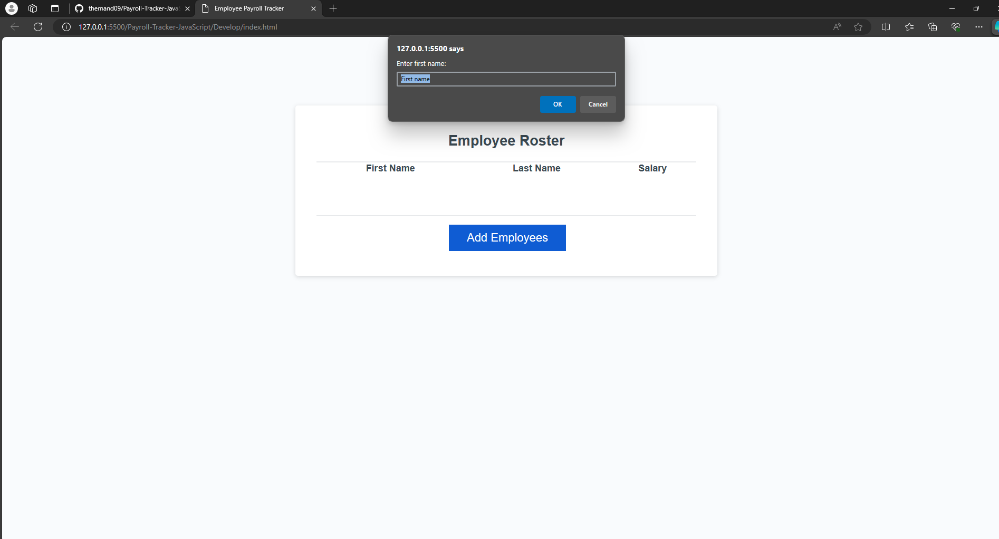
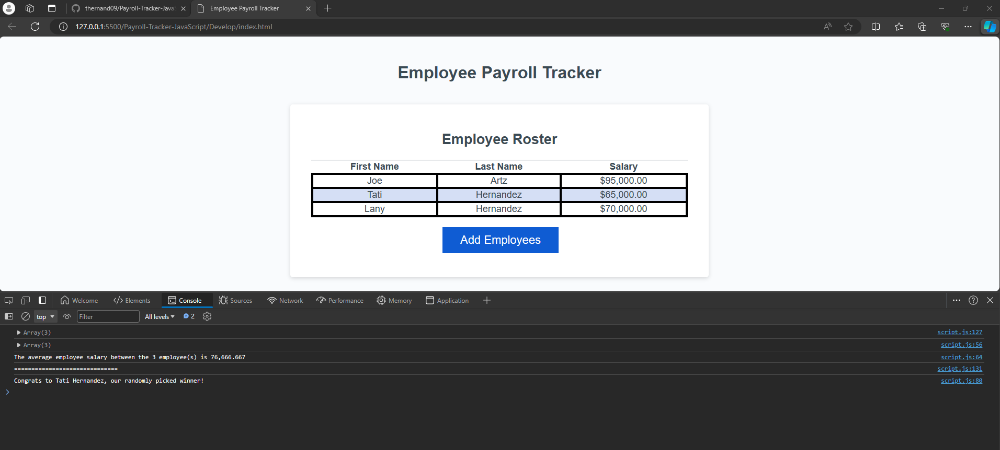

# Payroll-Tracker-JavaScript

## User Story

```md
AS A payroll manager
I WANT AN employee payroll tracker
SO THAT I can see my employees' payroll data and properly budget for the company
```

## Acceptance Criteria

```md
GIVEN an employee payroll tracker
WHEN I click the "Add employee" button
THEN I am presented with a series of prompts asking for first name, last name, and salary
WHEN I finish adding an employee
THEN I am prompted to continue or cancel
WHEN I choose to continue
THEN I am prompted to add a new employee
WHEN I choose to cancel
THEN my employee data is displayed on the page sorted alphabetically by last name, and the console shows computed and aggregated data
```

## Usage

Link for the repo: https://github.com/thernand09/Payroll-Tracker-JavaScript.git
Link for the website: https://thernand09.github.io/Payroll-Tracker-JavaScript/

## TryOuts

When clicking the Add Employee button:
    A window will populate asking the user to enter a "First name", "Last name", and "Salary

Once you enter your first employee string it will then:
    Ask the user if they would like to add another employee
    User will add as many employees needed

If user is done adding Employees they will press Cancel to stop adding employees
    Once Cancel is pressed the console will calculate the avg Salary between employees.
    It will also pick a random Employee as a winner.
    These will display in DevPlan under Console tool. 

## Screenshots

!


